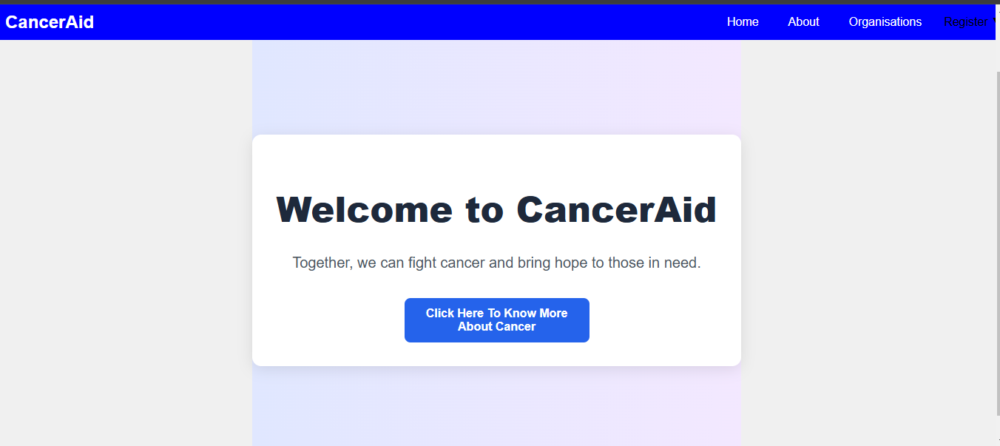
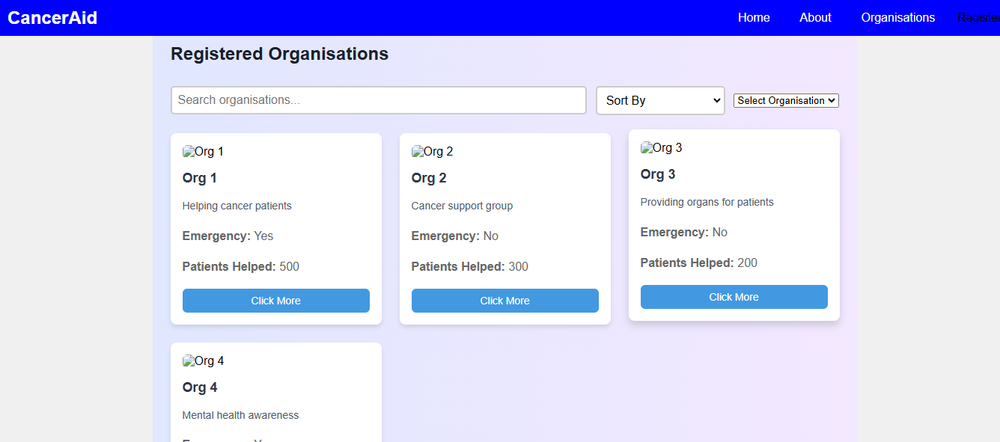
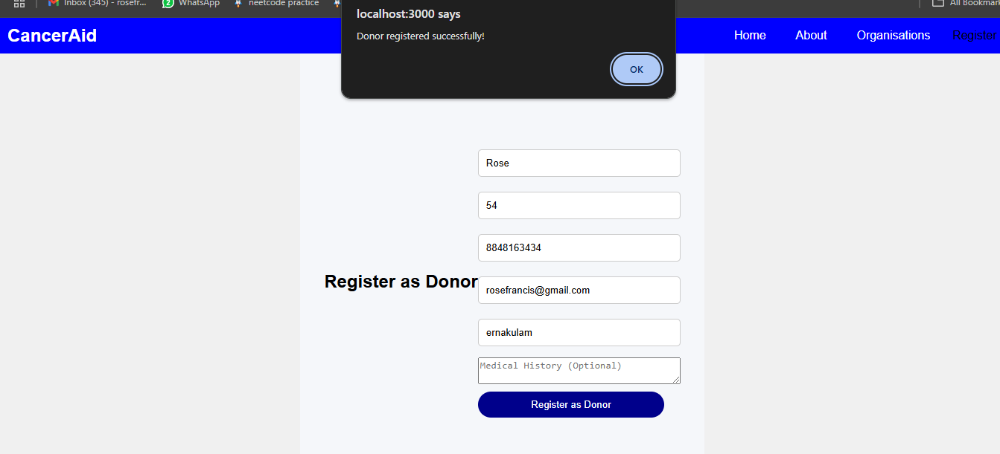
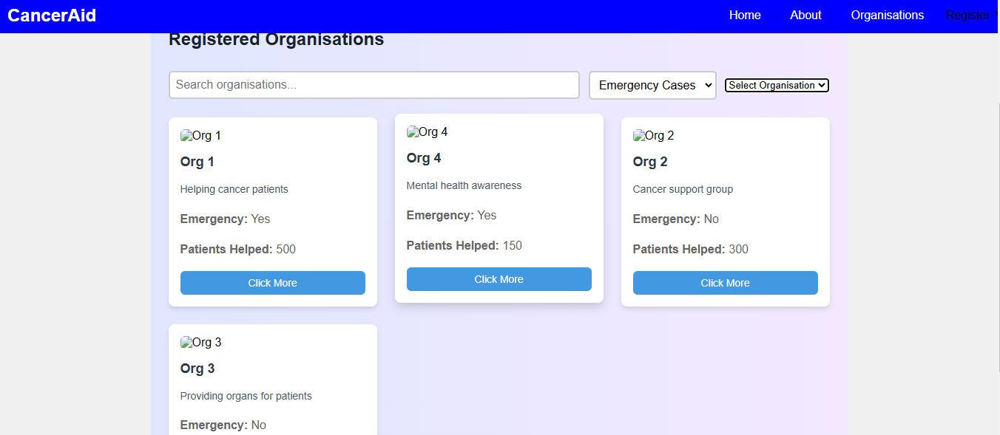
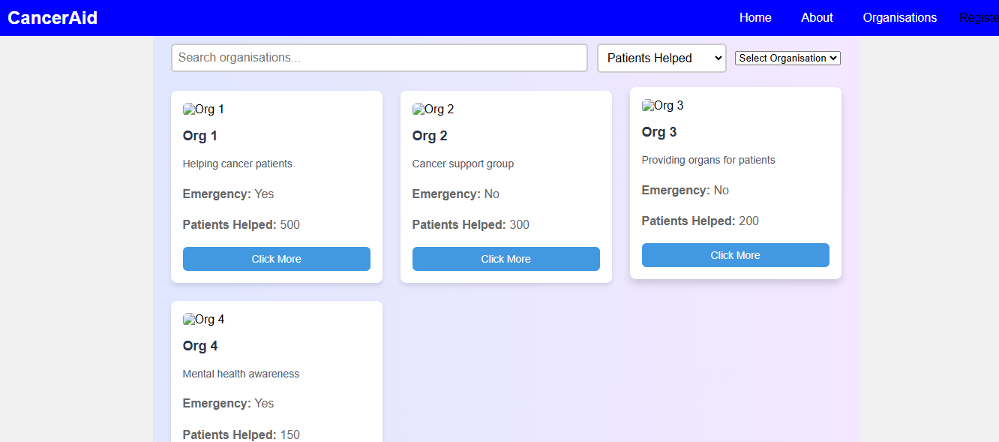
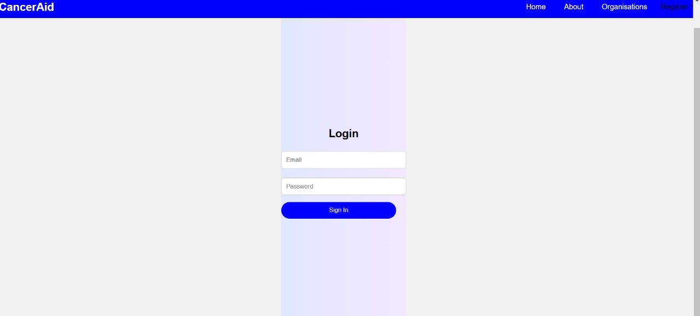

# [Project Name] 🎯

## Basic Details
### Team Name: [Spark]

### Team Members
- Member 1: [Sreepriya K M] - [Model Engineering College]
- Member 2: [Esha Susan Shaji] - [Model Engineering College]
- Member 3: [Rose Francis] - [Model Engineering College]

### Hosted Project Link
[mention your project hosted project link here]

### Project Description
[Cancer Support Network - Connecting Donors to Cancer Assistance Organizations

Our website serves as a platform that connects generous donors with organizations dedicated to helping cancer patients. The platform offers valuable information about cancer, its impacts, and available support options.

Key Features:

Login Page: Users can securely log in to their accounts to access personalized content.

User Registration: Users can register as either a Donor or an Organization. Donors can make a significant impact by contributing to organizations in need, while organizations can showcase their work and gain support.

Organization List: Donors can explore a comprehensive list of registered organizations. The list is sortable by:

Emergency Need: Helping donors prioritize organizations in urgent need of assistance.
Number of Patients Helped: Allows donors to understand the scale of support each organization is providing.
Important Cancer Information: The website provides users with essential cancer-related information to raise awareness and educate visitors on various aspects of cancer care and support.

This platform ensures that donors can make informed decisions about where to direct their support, while organizations gain visibility and assistance from the community.]

### The Problem statement
[Cancer organizations often struggle to secure sufficient funding and support, while donors face difficulty finding trustworthy causes to contribute to. There is a need for a platform that connects donors with organizations helping cancer patients, allowing donors to easily find and support organizations based on urgency and impact. This platform will help donors make informed decisions while ensuring that organizations receive the resources needed to continue their work.]

### The Solution
[We’ve created a web platform that connects donors with cancer support organizations. Donors can explore a list of registered organizations, sort them by urgency and impact, and make informed contributions to those in need, helping organizations get the support they require to assist cancer patients.]

## Technical Details
### Technologies/Components Used
For Software:
- [html, css, javascript, python]
- [FastApi]
- [React]
- [Nodejs]

For Hardware:
- [List main components]
- [List specifications]
- [List tools required]

### Implementation
For Software:
# Installation
[winget install OpenJS.NodeJS]
[pip install fastapi uvicorn]
[npm install react react-dom]
[npm install react-router-dom]

# Run
[uvicorn app.main:app --reload]
[npm start]

### Project Documentation
For Software:

# Screenshots (Add at least 3)

*This shows our home page*

*This shows the list of organisations like NGOs*

*People who are interested in donating money can register here*

*Organisations can be sorted in terms of emergency*

*Organisations can be sorted in terms of patients helped *

*Organisations can be sorted in terms of patients helped *

# Diagrams

*Add caption explaining your workflow*

For Hardware:

# Schematic & Circuit

*Add caption explaining connections*

*Add caption explaining the schematic*

# Build Photos

*List out all components shown*

*Explain the build steps*

*Explain the final build*

### Project Demo
# Video
[Add your demo video link here]
*Explain what the video demonstrates*

# Additional Demos
[Add any extra demo materials/links]

## Team Contributions
- [Name 1]: [Specific contributions]
- [Name 2]: [Specific contributions]
- [Name 3]: [Specific contributions]

---
Made with ❤️ at TinkerHub
